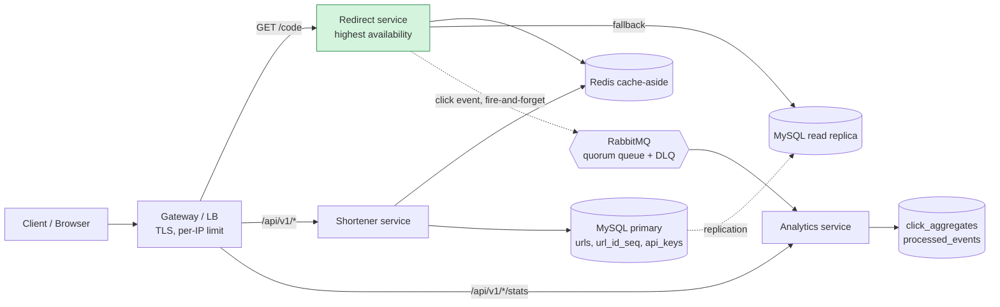
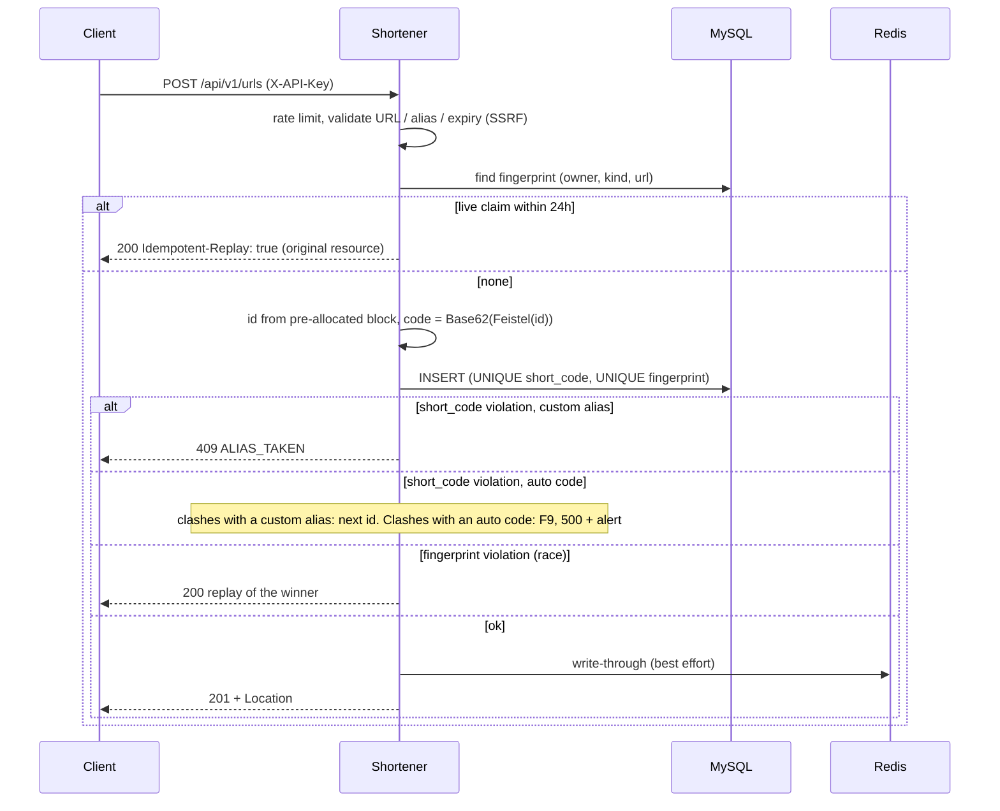
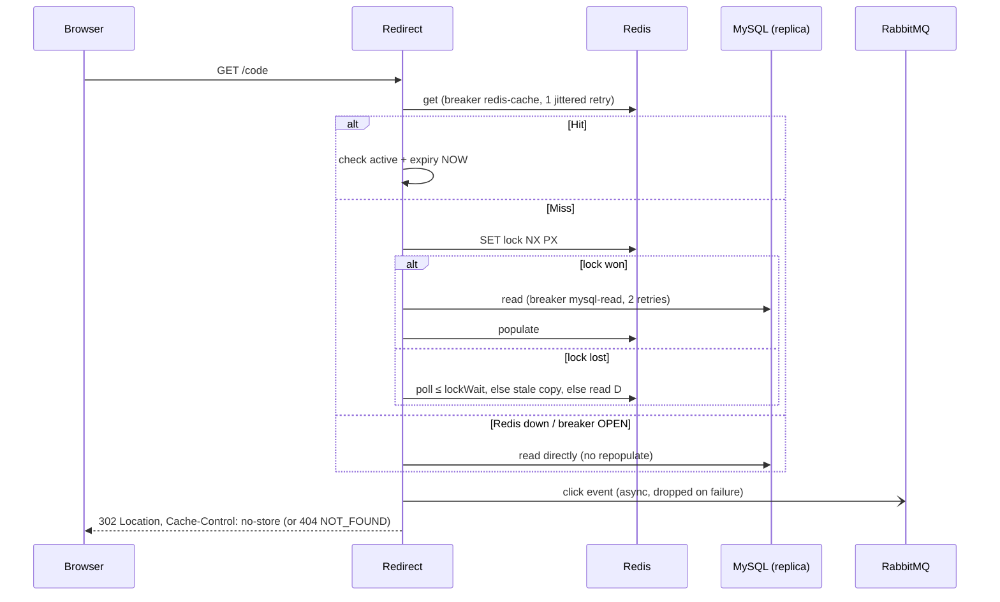
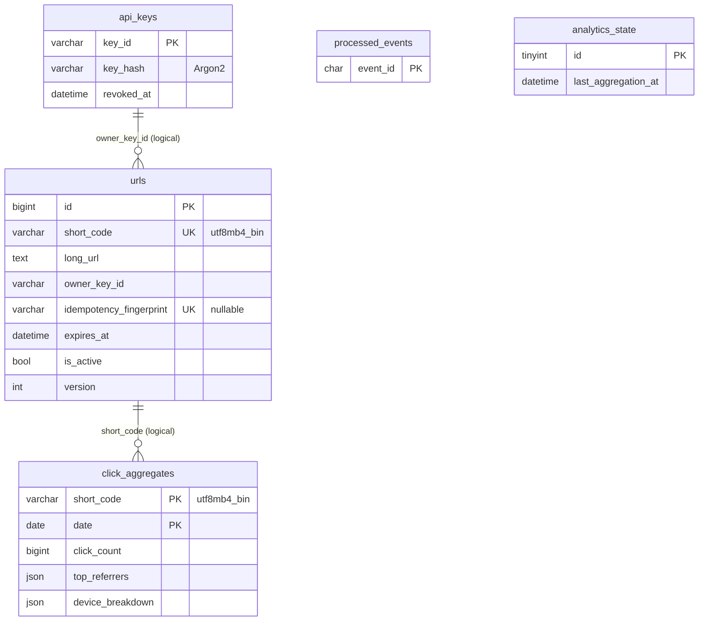
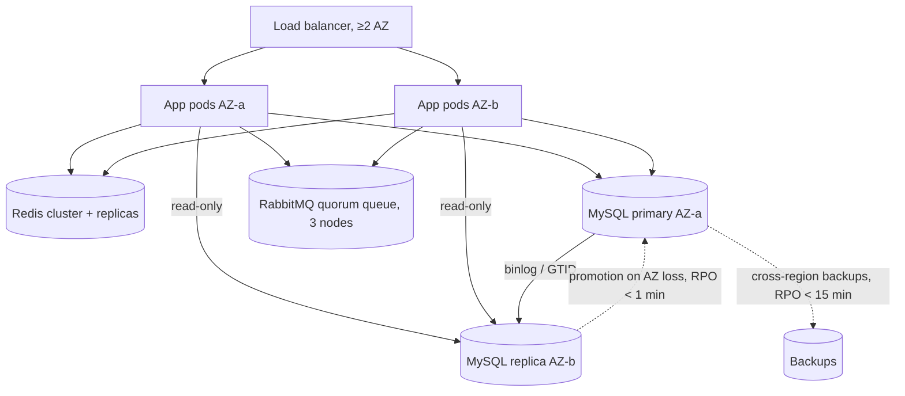
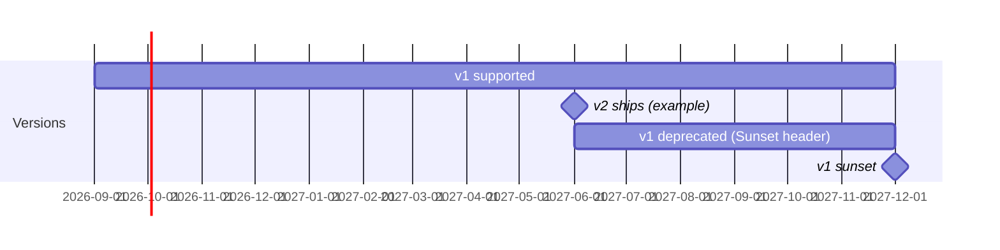

# Architecture diagrams (Mermaid)

## 1. Components



## 2. Create (idempotency and the alias race)



## 3. Redirect (hit, miss, stampede, Redis down)



## 4. Async analytics

```mermaid
sequenceDiagram
  participant Q as Queue (quorum)
  participant N as Consumer
  participant D as MySQL
  Q->>N: ClickEvent (at-least-once)
  N->>D: BEGIN; INSERT IGNORE processed_events(event_id)
  alt already seen (E21)
    N->>Q: ack (skip)
  else new
    N->>D: upsert row, SELECT … FOR UPDATE, bump counts/referrers/devices; COMMIT
    N->>Q: ack after commit
  end
  Note over Q,N: failure → nack/requeue → broker redelivers → after delivery-limit → DLQ
```

## 5. Data model



## 6. Failure-mode map (owner → rows)

```mermaid
flowchart TB
  subgraph Redirect
    F1[F1 Redis down] --- F2[F2 cache/DB desync] --- F7[F7 stampede] --- F12[F12 expiry sweep lag] --- F13[F13 clock skew]
  end
  subgraph Shortener
    F3[F3 primary down] --- F8[F8 counter contention] --- F9[F9 code collision]
  end
  subgraph Analytics
    F5[F5 queue down] --- F6[F6 consumer behind]
  end
  subgraph Cross-cutting
    F4[F4 read path, replica] --- F10[F10 AZ loss] --- F11[F11 auth store down]
  end
```



## 7. Deployment topology (F10, §13, §14)



## 8. API versioning timeline (§6.1)


